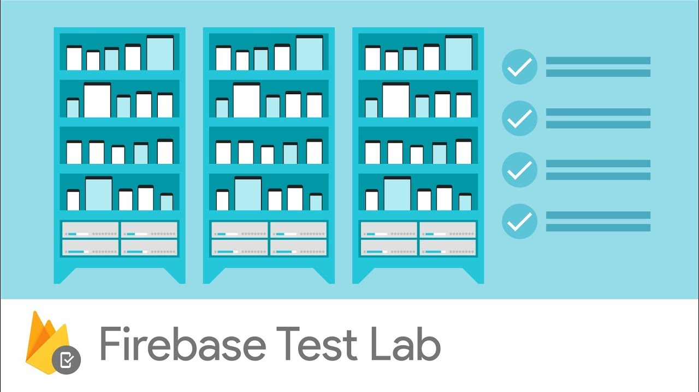

# Firebase Test Lab plugin for fastlane

<p align="center">
  
</p>

Inspired by [Firebase test lab plugin for ios](https://github.com/fastlane/fastlane-plugin-firebase_test_lab)


[](https://rubygems.org/gems/fastlane-plugin-firebase_test_lab_android)

## Getting Started

This project is a [_fastlane_](https://github.com/fastlane/fastlane) plugin. To get started with `fastlane-plugin-firebase_test_lab_android`, add it to your project by running:

```bash
(not yet)
fastlane add_plugin firebase_test_lab_android 
```

### If you are not current user of Firebase

You need to set up Firebase first. These only needs to be done once for an organization.

- If you have not used Google Cloud before, you need to [create a new Google Cloud project](https://cloud.google.com/resource-manager/docs/creating-managing-projects#Creating%20a%20Project) first.
- Go to the [Firebase Console](https://console.firebase.google.com/). Add Firebase into your Google Cloud project by clicking on "Add project" and then choose your just-created project.

### Configure Google credentials through service accounts

To authenticate, Google Cloud credentials will need to be set for any machine where _fastlane_ and this plugin runs on.

If you are running this plugin on Google Cloud [Compute Engine](https://cloud.google.com/compute), [Kubernetes Engine](https://cloud.google.com/kubernetes-engine) or [App Engine flexible environment](https://cloud.google.com/appengine/docs/flexible/), a default service account is automatically provisioned. You will not need to create a service account. See [this](https://cloud.google.com/compute/docs/access/service-accounts#compute_engine_default_service_account) for more details.

In all other cases, you need to configure the service account manually. You can follow [this guide](https://cloud.google.com/docs/authentication/getting-started) on how to create a new service account and create a key for it. You will need to set the `GOOGLE_APPLICATION_CREDENTIALS` environment variable pointing to the service account key file according to the document.

No matter if you are a using an automatically provisioned service account or a manually created one, the service account must be configured to have the project editor role.

### Enable relevant Google APIs

- You need to enable the following APIs on your [Google Cloud API library](https://console.cloud.google.com/apis/library) (see [this](https://support.google.com/cloud/answer/6158841) for instructions how):
  1. Cloud Testing API
  2. Cloud Tool Results API

### Find the devices you want to test on

If you have [gcloud tool](https://cloud.google.com/sdk/gcloud/), you can run

```no-highlight
gcloud beta firebase test android models list
```

to get a list of supported devices and their identifiers.

Alternatively all available devices can also be seen [here](https://firebase.google.com/docs/test-lab/ios/available-testing-devices). 


## Actions

Test your app with Firebase Test Lab with ease using fastlane.  
Check out the [example `Fastfile`](fastlane/Fastfile) to see how to use this plugin.

```ruby
before_all do
  ENV["SLACK_URL"] = "https://hooks.slack.com/services/XXXXXXXXX/XXXXXXXXX/XXXXXXXXXXXXXXXXXXXXXXXX"
end

firebase_test_lab_android(
  project_id: "cats-firebase",
  gcloud_service_key_file: "fastlane/client-secret.json",
  type: "robo",
  devices: [
    {
      model: "hammerhead",
      version: "21",
      locale: "ja_JP",
      orientation: "portrait"
    },
    {
      model: "Pixel2",
      version: "28"
    }
  ],
  app_apk: "test.apk",
  console_log_file_name: "fastlane/console_output.log",
  timeout: "1m",
  notify_to_slack: true
)
```

## Issues and Feedback

For any other issues and feedback about this plugin, please submit it to this repository.

## Troubleshooting

If you have trouble using plugins, check out the [Plugins Troubleshooting](https://docs.fastlane.tools/plugins/plugins-troubleshooting/) guide.

## Using _fastlane_ Plugins

For more information about how the `fastlane` plugin system works, check out the [Plugins documentation](https://docs.fastlane.tools/plugins/create-plugin/).

## About _fastlane_

_fastlane_ is the easiest way to automate beta deployments and releases for your iOS and Android apps. To learn more, check out [fastlane.tools](https://fastlane.tools).
