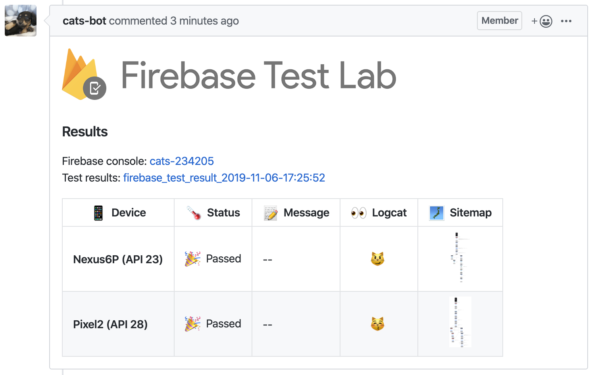
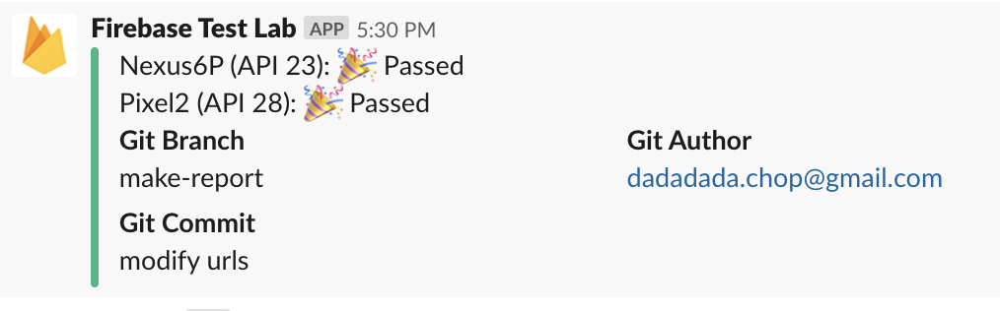

# Firebase Test Lab plugin for fastlane

<p align="center">
  
</p>

Inspired by [Firebase test lab plugin for ios](https://github.com/fastlane/fastlane-plugin-firebase_test_lab)


## Getting Started

[](https://github.com/cats-oss/fastlane-plugin-firebase_test_lab_android/blob/master/LICENSE)
[](https://rubygems.org/gems/fastlane-plugin-firebase_test_lab_android)
[](https://rubygems.org/gems/fastlane-plugin-firebase_test_lab_android)

### Step 1. First of all, get started with Firebase Test Lab from the gcloud Command Line

Please check [Firebase documents](https://firebase.google.com/docs/test-lab/android/command-line)

Using with Google Cloud SDK.
```
# gcloud firebase test android run \
  --type robo \
  --app app-debug-unaligned.apk \
  --device model=Nexus6,version=24,locale=en,orientation=portrait  \
  --timeout 90s
  
Have questions, feedback, or issues? Get support by visiting:
  https://firebase.google.com/support/

API [toolresults.googleapis.com] not enabled on project 
[************]. Would you like to enable and retry (this will take a 
few minutes)? (y/N)? y

Enabling service [toolresults.googleapis.com] on project [************]...
Operation "operations/acf.********-****-****-****-************" finished successfully.
  ...
  ...
  ...

Robo testing complete.

More details are available at [https://console.firebase.google.com/project/*******/testlab/histories/**********/matrices/********].
┌─────────┬───────────────────────┬──────────────┐
│ OUTCOME │    TEST_AXIS_VALUE    │ TEST_DETAILS │
├─────────┼───────────────────────┼──────────────┤
│ Passed  │ Nexus6-24-en-portrait │ --           │
└─────────┴───────────────────────┴──────────────┘
```

### Step 2. Add to your project
This project is a [_fastlane_](https://github.com/fastlane/fastlane) plugin. To get started with `fastlane-plugin-firebase_test_lab_android`, add it to your project by running:

```
fastlane add_plugin firebase_test_lab_android 
```

### Step 3. Find the devices you want to test on

Using [gcloud tool](https://cloud.google.com/sdk/gcloud/), you can run.

```
gcloud beta firebase test android models list
```

to get a list of supported devices and their identifiers.

Alternatively all available devices can also be seen [here](https://firebase.google.com/docs/test-lab/ios/available-testing-devices). 


### Step 4. Add settings to your Fastfile

Test your app with Firebase Test Lab with ease using fastlane.  
Check out the [example `Fastfile`](fastlane/Fastfile) to see how to use this plugin.

```ruby
before_all do
    ENV["SLACK_URL"] = "https://hooks.slack.com/services/XXXXXXXXX/XXXXXXXXX/XXXXXXXXXXXXXXXXXXXXXXXX"
  end

lane :test do

  # Get Pull request number from CI
  pr_number = ENV["CI_PULL_REQUEST"] != nil ? ENV["CI_PULL_REQUEST"][/(?<=https:\/\/github.com\/cats-oss\/android\/pull\/)(.*)/] : nil

  # Upload to Firebase Test Lab
  firebase_test_lab_android(
    project_id: "cats-firebase",                                    # Your Firebase project name.
    gcloud_service_key_file: "fastlane/client-secret.json",         # File path containing the gcloud auth key.
    type: "robo",                                                   # Optional: Test type (robo/instrumentation).
    devices: [                                                      # Devices
      {
        model: "Nexus6P",
        version: "23",
        locale: "ja_JP",
        orientation: "portrait"
      },
      {
        model: "Pixel2",
        version: "28"
      }
    ],
    app_apk: "app-debug.apk",                                       # The path for your android app apk.
    # app_test_apk: "app-test.apk",                                 # The path for your android instrumentation test apk.
    # use_orchestrator: false,                                      # If you use orchestrator when set instrumentation test.
    console_log_file_name: "fastlane/console_output.log",           
    timeout: "3m",                                                  
    firebase_test_lab_results_bucket: "firebase_cats_test_bucket",  # If you want to naming bucket of GCS 
    # firebase_test_lab_results_dir: "firebase_cats_test_dir",      # If you want to naming results of GCS. (Maybe don't need it.) 
    slack_url: ENV["SLACK_URL"],                                    # If you want notify to Slack.

    # If you want notify to Github pull requests.
    github_owner: "******",                                         # Owner name. 
    github_repository: "************",                              # Repository name.
    github_pr_number: pr_number,                                    # If you using run on CI that need pull request number for auto comment.
    github_api_token: ENV["GITHUB_API_TOKEN"],                      # https://github.com/settings/tokens
    download_dir: ".results",                                       # If you want to download to the results of Firebase test lab.  

    # If you want to ignore some social sign-in buttons.
    extra_options: "--robo-directives ignore:image_button_sign_in_twitter=,ignore:image_button_sign_in_instagram="
  )
end
```

### Finish. Check your slack or Github PR

**If you set `slack_url: ENV["SLACK_URL"]` to Fastfile.**



**If you set `github_owner, github_repository, github_pr_number, github_api_token` to Fastfile.**


## Issues and Feedback

For any other issues and feedback about this plugin, please submit it to this repository.

## Troubleshooting

If you have trouble using plugins, check out the [Plugins Troubleshooting](https://docs.fastlane.tools/plugins/plugins-troubleshooting/) guide.

## Using _fastlane_ Plugins

For more information about how the `fastlane` plugin system works, check out the [Plugins documentation](https://docs.fastlane.tools/plugins/create-plugin/).

## About _fastlane_

_fastlane_ is the easiest way to automate beta deployments and releases for your iOS and Android apps. To learn more, check out [fastlane.tools](https://fastlane.tools).
